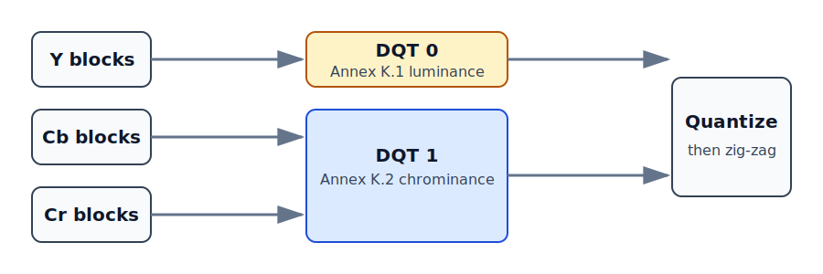

# 4. Quantization: where JPEG deliberately loses detail

The DCT changed representation but did not make many real photographs small.
Quantization rounds frequency coefficients so that unimportant values become zero.
Long runs of zeros are cheap to encode later.

## One coefficient by hand

```text
DCT coefficient:       47
quantizer entry:        10
47 / 10:               4.7
stored coefficient:      5
decoded approximation:  5 × 10 = 50
```

The difference from 47 to 50 is the loss. A larger divisor produces more loss and
usually more zeros.

## A table, not one divisor

Every one of the 64 frequency positions has its own divisor. Low frequencies
usually receive smaller divisors because broad changes are visually important.
High frequencies often receive larger divisors because fine detail can tolerate
more rounding.

[T.81 Annex K](https://www.w3.org/Graphics/JPEG/itu-t81.pdf) provides **example**
luminance (K.1) and chrominance (K.2) tables. Neither is mandated by the format.
This project uses both as recognizable base tables.

```scala
quantized(i) = round(coefficients(i) / table(i))
decoded(i)   = quantized(i) * table(i)
```

## Zig-zag is an ordering, not another transform

The 8×8 coefficients live in row/column order, but JPEG transmits them diagonally
from low to high frequency. This is called **zig-zag order**.

```text
 0 →  1    5 →  6   ...
      ↓  ↗
 2    4    7
 ↓  ↗
 3
```

After quantization, zeros tend to gather near the high-frequency end. Zig-zag
turns that two-dimensional cluster into one long one-dimensional zero tail.
T.81 Figure A.6 defines the exact permutation.

Both scan coefficients and DQT payload entries use zig-zag order. Forgetting the
second case produces files that parse correctly but reconstruct with the wrong
divisor at each frequency.

## Quality is encoder policy

JPEG files store the final table, not “quality 85.” `Quality` scales the example
table using the conventional Independent JPEG Group curve, then clamps every
entry to `1..255`.

- quality 50: base table unchanged;
- quality 100: every entry becomes 1;
- low quality: entries grow and more detail becomes zero.

Quality 100 is still not the separate lossless JPEG process.

## Why color uses two tables

Y carries brightness structure, while Cb and Cr carry color difference. The eye
is generally more sensitive to fine brightness edges than equally fine color
changes. The Annex K chrominance table therefore reaches large divisors sooner.



The encoder writes the scaled luminance table as DQT identifier 0 and the scaled
chrominance table as identifier 1. SOF0 connects components to them explicitly:

| component | meaning | SOF0 table selector |
| --- | --- | ---: |
| 1 | Y | 0 |
| 2 | Cb | 1 |
| 3 | Cr | 1 |

This selection is independent of 4:4:4, 4:2:2, or 4:2:0 sampling. Sampling changes
how many component blocks exist; quantization changes how accurately each block's
frequencies survive. Keeping those decisions separate also ensures Huffman
optimization counts the coefficients that will actually be written.

## Scala invariants

`Block` ensures every table has exactly 64 entries. `Quality` is an opaque type,
so an arbitrary width or coefficient cannot be passed accidentally as quality.
The quantize and dequantize functions accept tables explicitly, making table
selection visible to callers.

## Executable checkpoints

Tests verify that natural→zig-zag→natural is the identity, quality 50 preserves
both Annex K tables, DQT payloads use zig-zag order, SOF0 selects tables 0/1/1,
quality endpoints remain legal, and higher quality generally produces a larger
stream for a textured image.
